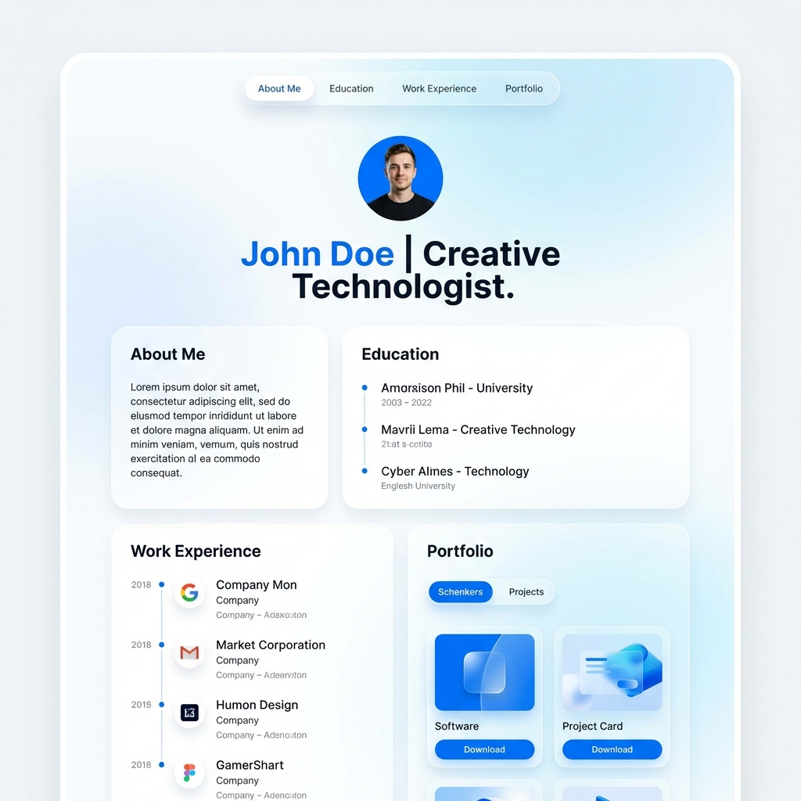

# Personal Resume Website (個人履歷網頁)

這是一個現代化、風格明亮且具科技感的個人履歷網站專案。使用 **Vue 3** + **Vite** 構建，並搭配純 CSS (Vanilla CSS) 實現高效能且優雅的視覺效果。



## ✨ 特色

- **現代科技感**: 採用毛玻璃 (Glassmorphism) 效果、細緻陰影與流暢的轉場動畫。
- **圓角設計**: 統一的大圓角風格，介面親和且現代。
- **響應式佈局**: 完美支援桌面與行動裝置瀏覽。
- **高效能**: 基於 Vite 與 Vue 3 Composition API 開發。
- **圖示整合**: 使用 Lucide Vue 提供高品質的向量圖示。

## 🛠️ 技術棧

- **Core**: Vue 3 (Composition API)
- **Build Tool**: Vite
- **Styling**: Modern Vanilla CSS (CSS Variables)
- **Icons**: Lucide Vue

## 🚀 快速開始

### 1. 安裝依賴

```bash
npm install
```

### 2. 啟動開發伺服器

```bash
npm run dev
```
啟動後即可在瀏覽器中預覽 (預設: `http://localhost:5173`)。

### 3. 建置生產版本

```bash
npm run build
```

## 📂 專案結構

- `src/App.vue`: 主要應用程式進入點與頁面結構。
- `src/style.css`: 全域樣式變數與設計系統定義。
- `src/main.js`: 應用程式掛載點。

## 📦 部署 (GitHub Pages)

本專案已準備好部署至 GitHub Pages。
請確保在 `vite.config.js` 中設定正確的 `base` 路徑：

```javascript
export default defineConfig({
  base: '/你的倉庫名稱/', // 修改這裡
  plugins: [vue()],
})
```

然後執行建置並將 `dist` 資料夾推送至 `gh-pages` 分支。

---
&copy; 2026 MyResume. Built with Vue.js.
